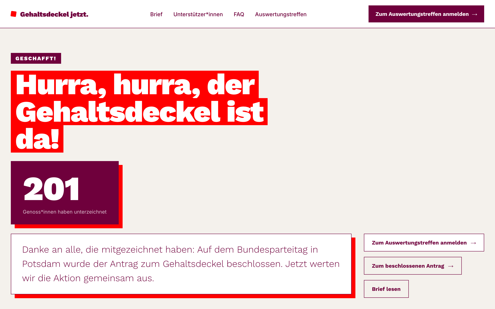

# Open Letter

A self-hosted platform for open letters and petitions. People sign, confirm by email, and appear on a public list with a live goal counter. One deployment serves one letter, and everything about a campaign — text, branding, theme, emails, features — is config.



## Features

- **Email-verified signatures** — double opt-in, public signer list with search, milestone/goal counter
- **Admin dashboard** — edit email templates, schedule newsletter campaigns, set milestones at runtime
- **Email via Resend or any SMTP server**, with durable, resumable send queues
- **Encrypted at rest** — SQLite with SQLCipher, plus encrypted hourly backups
- **GDPR-minded** — retention periods set in config, enforced by the server and quoted in the privacy policy
- **Optional modules** — German-state map, Kreisverband/occupation fields, Zoom or in-person event sign-up
- **Cheap to run** — a 0.5 vCPU / 512 MB VPS serves 100,000 signers ([numbers](docs/hardware.md))

## Try it

```bash
cp .env.example .env
docker compose -f docker-compose.dev.yml up --build
```

The placeholder values in `.env.example` are fine for the demo. It opens at http://localhost:3000 with 200 demo signers, plus a new one every 6 seconds.

Without Docker (needs [Bun](https://bun.sh); SQLCipher is bundled):

```bash
bun install
cp .env.example .env    # placeholders work for local dev
bun run db:setup
bun run dev             # http://localhost:3000
bun run db:seed         # optional, in a second terminal
```

## Launch your own letter

1. Copy a letter: `cp -r config/letters/example config/letters/my-letter` (`example` is a minimal English starter; `gehaltsdeckel` uses every feature).
2. Edit `index.js` (brand, theme, copy, legal entity, emails, `features`) and `content.jsx` (the letter and FAQ).
3. Register it in the `LETTERS` map in `config/letter.config.js` and the `CONTENT` map in `config/content.jsx`.
4. Replace assets in `public/` and regenerate the social image with `bun run og` while the site is running.
5. Set `LETTER_CONFIG=my-letter` and deploy.

No changes to application code. All config keys: [docs/configuration.md](docs/configuration.md).

## Deploy

```bash
docker compose up --build -d
```

The database is a single encrypted SQLite file on a volume; there is no separate database service. Required env:

| Variable | |
| --- | --- |
| `DATABASE_ENCRYPTION_KEY`, `BACKUP_ENCRYPTION_KEY` | Two distinct SQLCipher keys (`openssl rand -hex 32`) for the database and backups. Store them apart from the backups. |
| `BASE_URL` | Public URL, used in email links |
| `ADMIN_PATH`, `ADMIN_PASSWORD`, `ADMIN_JWT_SECRET` | Secret admin route and login (password ≥ 16 chars, JWT secret ≥ 32) |
| `API_TOKEN_SECRET` | Public API token key, distinct from `ADMIN_JWT_SECRET` |
| `LETTER_CONFIG` | Which letter to serve (default `gehaltsdeckel`) |
| `RESEND_API_KEY` or `SMTP_*` | Mail provider credentials for the `email.provider` set in the letter config |

The compose file sets `NODE_ENV=production`. The admin dashboard is at `/<ADMIN_PATH>`, the health check at `/api/health`. Behind a reverse proxy, set `TRUST_PROXY=true` and enable gzip/brotli there. Backups, restore, retention and ending a campaign: [docs/operations.md](docs/operations.md).

## Stack

[Bun](https://bun.sh) (server, bundler, package manager) · React 18 · SQLite + [SQLCipher](https://www.zetetic.net/sqlcipher/) · [Honker](https://honker.dev) durable jobs · Resend / nodemailer

## Docs

- [Configuration](docs/configuration.md) — letter config, env vars, email
- [Operations](docs/operations.md) — deployment, scripts, backups, retention, jobs
- [HTTP API](docs/api.md)
- [Security](docs/security.md)
- [Hardware requirements](docs/hardware.md)

## License

[MIT](LICENSE)
